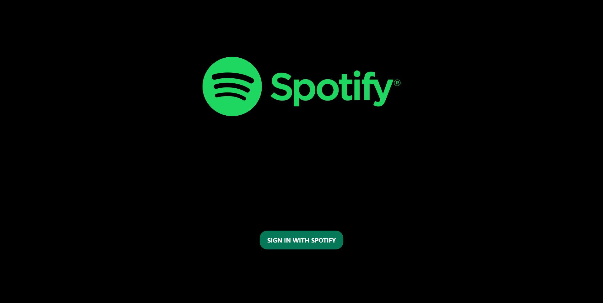
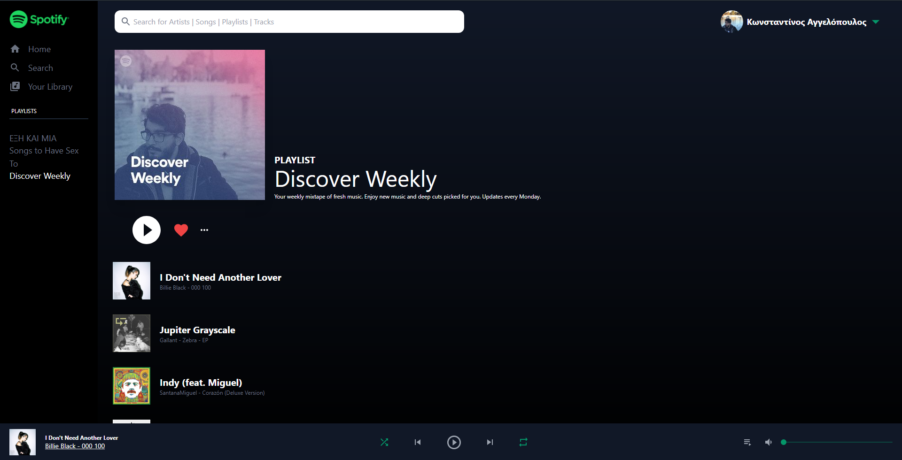

# Spotify clone

A [spotify clone](https://www.spotify.com) using [ReactJS](https://reactjs.org), React Context API, [TailwindCSS](https://tailwindcss.com) & [Material UI icons](https://material-ui.com) for the frontend and [Spotify for developers](https://developer.spotify.com) for the backend authentication and authorization.

## Requirements

Inside the repo there is a [.env.example file](./.env.example). Rename it to .env and fill the values with your own api keys.

For Spotify Api you will need a spotify client id from [spotify developer API](https://developer.spotify.com) with the following values.

```javascript
REACT_APP_SPOTIFY_CLIENT_ID=
```

## Usage

Assuming you have [npm](https://www.npmjs.com) or [yarn](https://www.yarnpkg.com) installed, clone the repo and run the following code:

```bash
npm install && npm start

or

yarn install && yarn start
```

## Examples

Electron app
<br>
<p align="center">
  
  
  
</p>
